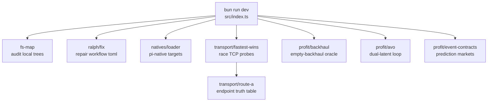

# sovereign-dispersal

> **Seven overlooked substrates. One Bun monolith. Deploy-ready proof of concept.**

<div align="right">

[](https://github.com/toxicwind/sovereign-dispersal/actions/workflows/ci.yml)
[](https://bun.sh/)
[](https://www.typescriptlang.org/)

</div>

A filesystem auditor, a workflow surgeon, a native-target loader, a fastest-wins transport racer, a profit oracle, a dual-latent reasoning loop, and an event-contract market substrate — fused into a single Bun codebase you can clone, test, and ship as a Docker image today.

**Why care:** every substrate answers a real ops question with runnable code — which roots are duplicated, which workflow keys are orphaned, which endpoint actually answers first, what an empty backhaul is worth — with zod-validated math and an animated dashboard to watch it all run.

> **License:** none declared in this repo — treat the code as all-rights-reserved until a license lands. **Security:** `ralph:fix` and `audit` write to `~/.config/` on the machine they run on (by design); tests never touch home.

## Features

- **Sovereign FS-Map** (`src/sovereign/fs-map.ts`) — audits the big local trees: symlink counts, git repos, duplicate top-level names across roots; persists JSON to `~/.config/sovereign-fs-map.json`
- **Ralph regen** (`src/ralph/fix.ts`) — strips orphan role keys (`planning=`, `development=`, …) from `~/.config/ralph-workflow.toml`, backs up first, sanity-checks string `cmd` and the `exa`/`ddgs` provider enum
- **Pi-natives loader** (`src/natives/loader.ts`) — builds explicit native targets one by one so a single broken target can't wedge the loader; skips cleanly when the engine checkout is absent
- **Fastest-wins transport** (`src/transport/fastest-wins.ts`) — races TCP probes with `Promise.any` + `AbortController`: first OPEN socket wins, the rest cancel; a fast failure never beats a slower success, and it rejects only when every probe fails
- **Route A** (`src/transport/route-a.ts`) — fastest-wins over a zod-validated endpoint set with a live/expected truth table (`verifyLive()`) and the documented resolver repair (`dnsFix()`)
- **Empty-backhaul oracle** (`src/profit/backhaul.ts`) — the EBITDA lift from buying empty return legs at a discount: 2.5% → 7.33%, a 2.93× lift at 25% discount (zod-validated inputs)
- **AVO dual-latent loop** (`src/profit/avo.ts`) — routes each step through the visual (`Z^v`) or reasoning (`Z^r`) latent, router width k ∈ {4, 8, 16}; seeded runs are reproducible
- **Event contracts** (`src/profit/event-contracts.ts`) — prediction-market substrate: targets, settlement rules, cents-as-probability, trading-prohibition checks
- **Animated dashboard** (`dashboard.html`) — fastest-wins pulse, backhaul flow, AVO memory bricks, Route A truth table

## Map



## Quick start

```bash
bun install
bun test
bun run dev          # walks all seven substrates
```

Open `dashboard.html` in a browser for the animated substrate dashboard.

## Architecture

| Path | Owns |
|---|---|
| `src/index.ts` | full substrate walk (`bun run dev`) |
| `src/sovereign/fs-map.ts` | filesystem audit → `~/.config/sovereign-fs-map.json` |
| `src/ralph/fix.ts` | workflow repair (`bun run ralph:fix`) |
| `src/natives/loader.ts` | explicit native targets (`bun run natives:build`) |
| `src/transport/fastest-wins.ts` + `route-a.ts` | probe racing + endpoint truth table (`bun run route-a`) |
| `src/profit/backhaul.ts` / `avo.ts` / `event-contracts.ts` | the three profit toys |
| `scripts/` | `audit.ts`, `ralph-fix.ts`, `natives.ts`, `deploy.ts` |
| `tests/` | `backhaul`, `fastest-wins`, `substrates` suites |
| `dashboard.html` | animated substrate dashboard |
| `Dockerfile` | multi-stage build, runs as non-root `bun` |

## Config

| Variable | Used by | Effect |
|---|---|---|
| `DEPLOY_PUSH=1` | `bun run deploy` | push the built image after `docker build` |
| `DEPLOY_IMAGE=…` | `bun run deploy` | image name/tag to build and push |

Deploy targets: distribute the image at the edge via Fastly / Comcast Qwilt Open Edge; mount data with a Modal `CloudBucketMount` at `/mnt/s3/my-data`.

## Dev

```bash
bunx biome check ./src ./scripts ./tests   # lint
bun run build                               # production build → dist/
```

CI (`.github/workflows/ci.yml`) runs on every push to `main` and every PR: `bun install --frozen-lockfile`, biome check, `bun test`, `bun run build`. Per-substrate scripts: `bun run route-a`, `bun run audit`, `bun run ralph:fix`, `bun run natives:build`, `bun run profit:backhaul`, `bun run profit:avo`.

## License + security

- **License:** none declared in this repo — treat the code as all-rights-reserved until a license is added.
- **Writes to home:** `bun run ralph:fix` backs up then rewrites `~/.config/ralph-workflow.toml`; `bun run audit` writes `~/.config/sovereign-fs-map.json`. That's the point — but know it before running in CI. Tests never touch home.
- **Route A probes real hosts:** `cdn` and `sandbox.team` are unresolvable by design (expected-FAIL rows in the truth table).
